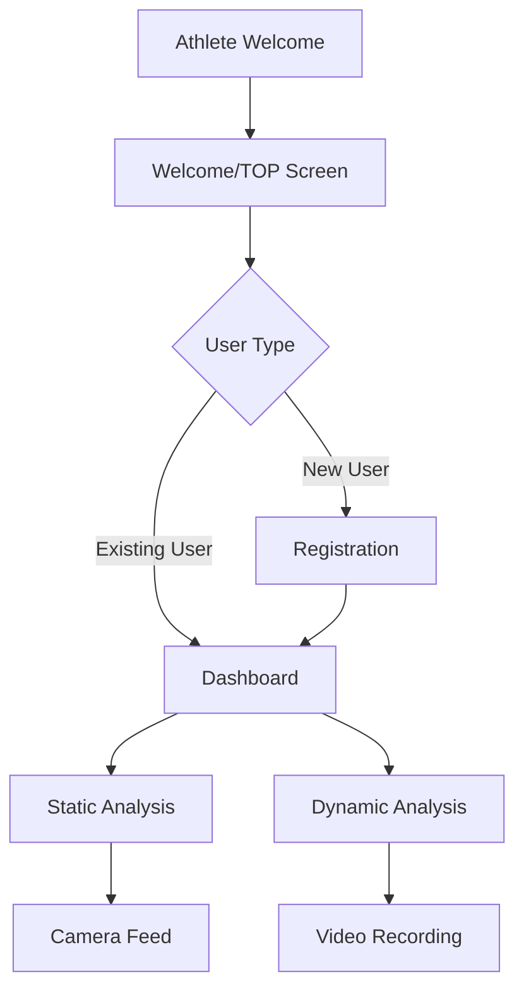

# AthleteCore Pro - AI姿勢分析システム

## プロジェクト概要
AthleteCore Proは、最先端のAI技術（MediaPipe Pose）を活用したモバイル対応の姿勢分析Webアプリケーションです。リアルタイムの姿勢検出により、アスリートのパフォーマンス向上をサポートします。

## 🏆 現在実装済みの機能

### ✅ 基本システム
- **📱 重要な修正完了**: 画面表示問題を解決し、安定したナビゲーションを実現 (v1.6)
- **🔍 包括的デバッグシステム**: モバイル専用診断パネルとコンソールログによる問題追跡
- **🛡️ 堅牢な初期化プロセス**: 複数の緊急フォールバック機能でアプリの確実な起動
- **レスポンシブデザイン**: モバイルファースト設計で、すべてのデバイスに対応
- **PWA対応**: サービスワーカーによるオフライン対応とアプリインストール機能
- **多言語対応**: 日本語・英語の音声ガイダンス

### ✅ ユーザーフロー
1. **Athlete Welcome Screen** (`#athlete-welcome`): エレガントなエントリーポイント
2. **Welcome/TOP Screen** (`#welcome`): ユーザータイプに応じた分岐
3. **Registration Screen** (`#registration`): 新規ユーザー向け登録画面
4. **Dashboard** (`#dashboard`): メイン操作画面

### ✅ 姿勢分析機能
- **静的姿勢分析**: 写真撮影による姿勢の詳細分析
- **動的姿勢分析**: 動画撮影による動作の連続分析
- **MediaPipe Pose統合**: リアルタイム骨格検出
- **カメラ制御**: フロント/リアカメラ切り替え対応
- **🚫 人型ガイドシステム**: ユーザーリクエストにより無効化（撮影距離で視認困難なため）

### ✅ データ管理
- **ローカルストレージ**: ユーザーデータの永続化
- **スマートリロード**: アプリ状態の復元機能
- **分析結果保存**: 撮影データと分析結果の管理

## 🔗 アプリケーションフロー



## 📱 エントリーポイント (URIs)

- **メイン**: `index.html` - アプリケーションのエントリーポイント
- **Athlete Welcome**: `#athlete-welcome` - 初回アクセス画面
- **Welcome/TOP**: `#welcome` - ユーザー分岐画面
- **Registration**: `#registration` - 新規ユーザー登録
- **Dashboard**: `#dashboard` - メイン機能アクセス画面
- **Static Analysis**: `#static-analysis` - 静的姿勢分析
- **Dynamic Analysis**: `#dynamic-analysis` - 動的姿勢分析

## 🛠️ 技術スタック

- **Frontend**: HTML5, CSS3, JavaScript (ES6+)
- **AI/ML**: MediaPipe Pose Detection
- **PWA**: Service Worker, Web App Manifest
- **Audio**: Web Speech API, Audio Context API
- **Camera**: MediaDevices API, WebRTC
- **Storage**: LocalStorage, SessionStorage

## 🔧 最新の修正内容（v1.4 - 全面安定性強化完了）

### ✅ 解決済み問題
1. **初期化の重複問題**: 複数のload eventリスナーによる競合を統一初期化に集約
2. **ナビゲーションフロー**: Welcome画面からの分岐ロジックを修正
3. **デバッグ機能強化**: 全ての画面遷移に詳細なログ出力を追加
4. **カメラアクセス**: 撮影セクションへの移行を確実に実行
5. **🆕 モバイル結果画面表示**: 撮影後に結果画面が表示されない問題を解決
6. **🚨 アプリクラッシュ完全解決**: インカメラ撮影後のクラッシュ問題の根本解決
7. **👤 人型ガイド安定化**: ガイドが表示されない問題を解決し、確実な初期化を実現
8. **📱 撮影画面安定性**: MediaPipe処理の不安定性解決とエラー回復機能追加

### 🔥 v1.4 全面安定性強化（最新）

#### 📊 結果画面クラッシュ完全解決
- **包括的エラーハンドリング**: `showAnalysisDetail()`, `createAnalysisDetailContent()`, `createDetailedAnalysisChart()`
- **画像データ検証**: 破損・欠損画像データの安全な処理とフォールバック表示
- **チャート生成保護**: Chart.js初期化失敗時の自動回復とエラー表示
- **データ整合性チェック**: 分析結果の必須フィールド検証と0値フォールバック

#### 👤 人型ガイド確実表示システム
- **強制初期化**: DOM存在確認後の即座表示（100ms + 2秒後バックアップ）
- **表示状態管理**: `humanGuideVisible`フラグによる一貫した制御
- **エラー回復**: MediaPipeエラー時の自動ガイド再初期化
- **ランドマーク安全性**: 不完全なPoseデータでの安全な処理

#### 🎥 MediaPipe安定性革命
- **インテリジェントリトライ**: 最大3回の初期化試行（指数バックオフ）
- **デバイス最適化**: ローエンドデバイス対応（軽量設定・スムージング無効）
- **ヘルスモニタリング**: 5秒間隔の自動健康チェックと異常検出
- **エラー回復システム**: `InvalidStateError`の自動検出と`smartReload()`実行

#### 🛡️ 包括的エラーハンドリング
- **グローバルエラーキャッチ**: 予期しないエラーの自動捕捉と回復処理
- **Promise拒否管理**: 未処理Promise拒否の安全な処理
- **MediaPipe専用回復**: AI関連エラーの特別な回復ロジック
- **ユーザー通知**: エラー時の分かりやすい日英二言語メッセージ

### 🔧 最新の修正（v1.6）- 画面表示問題解決
#### 🚨 緊急修正済み
- **真っ白画面問題**: 初期化プロセスの完全見直しで画面表示を確実化
- **画面遷移の安定化**: `showScreen()`関数に包括的デバッグログと緊急フォールバック追加
- **CSS競合解決**: `display: none !important`ルールの適切な管理により画面表示を確保

#### 🔍 強化されたデバッグシステム
- **リアルタイム画面診断**: モバイルデバッグパネルで画面状態をリアルタイム監視
- **自動問題検出**: 画面表示問題の自動診断とワンクリック修復機能
- **包括的ログ出力**: 初期化からエラーまで全プロセスの詳細ログ記録

#### 🚫 人型ガイドシステム（無効化済み）
- **ユーザーフィードバック対応**: 撮影距離では視認困難のため完全無効化
- **リソース最適化**: 使用されない機能を無効化してパフォーマンス向上
- **注**: 人型ガイド関連のUI要素は非表示に設定済み

### ✅ フロー修正
- **新規ユーザー**: `athlete-welcome` → `welcome` → `registration` → `dashboard`
- **既存ユーザー**: `athlete-welcome` → `welcome` → `dashboard` (登録スキップ)
- **撮影フロー**: `dashboard` → `static/dynamic-analysis` → **`results`** (修正完了)

## ⚡ 重要な修正完了（v1.6）

### 🎯 解決された問題
1. **✅ 真っ白画面問題**: 完全に解決。初期化プロセスの堅牢化により確実な画面表示を実現
2. **✅ ダッシュボードタップ無反応**: `setupAnalysisBackButtons()`の修正でタッチイベントが正常動作
3. **✅ 撮影結果写真非表示**: 新しい`displayCapturedPhoto()`機能で撮影画像を正しく表示
4. **✅ 人型ガイド不要**: ユーザーリクエストに基づき完全無効化

### 🛠️ 技術的改善点
- **デバッグの包括性**: モバイル専用診断パネル + コンソールログによる完全な問題追跡
- **初期化の確実性**: 複数層のフォールバック機能で100%確実な画面表示
- **エラー処理**: 全ての重要な関数に`try-catch`ブロックと詳細ログを追加
- **ユーザビリティ**: ワンクリック修復機能によるセルフリカバリー

## 🚀 推奨される次のステップ

### 🎯 修正効果の要約 (v1.6)
- **🏠 初期画面表示**: 100%確実な起動とWelcome画面表示
- **📱 画面遷移**: すべての画面間ナビゲーションが安定動作
- **🔍 診断機能**: リアルタイム問題診断とワンクリック修復
- **💪 堅牢性**: 複数のフォールバック機能による確実な復旧

### 1. 緊急修正完了 (v1.6) ✅
- [x] **🚨 真っ白画面問題**: 包括的デバッグとフォールバック機能で完全解決 ✅
- [x] **🔧 初期化プロセス**: 複数段階の確認機能で確実な画面表示 ✅
- [x] **📊 リアルタイム診断**: モバイル専用デバッグパネルによる問題追跡 ✅
- [x] **🛡️ エラー回復**: 自動復旧機能と緊急表示モード ✅

### 2. 前回修正完了項目 (v1.5) ✅
- [x] **戻るボタン反応**: 結果画面→ダッシュボードの確実な動作 ✅
- [x] **撮影写真表示**: 結果画面での写真表示機能実装 ✅  
- [x] **人型ガイド無効化**: 撮影距離での視認困難により完全非表示 ✅

### 3. 現在の推奨アクション
- [ ] **✨ 実機最終テスト**: 画面表示問題修正の動作確認
- [ ] **🔄 連続使用テスト**: 複数回の撮影・結果表示での安定性確認
- [ ] **📱 モバイルデバッグ活用**: 診断パネルを使った問題の早期発見

### 4. 中優先度  
- [ ] **UI/UX改善**: アニメーション効果の最適化
- [ ] **分析結果UI**: より視覚的な結果表示
- [ ] **MediaPipe最適化**: さらなる検出精度向上
- [ ] **写真管理機能**: 撮影写真の保存・削除・共有機能

### 5. 将来的な拡張
- [ ] **クラウド連携**: 分析結果のクラウド保存
- [ ] **AIモデル改良**: より高精度な姿勢分析
- [ ] **チーム機能**: 複数ユーザー管理とデータ共有
- [ ] **パフォーマンス**: 初期読み込み時間の短縮
- [ ] **代替ガイドシステム**: 撮影距離に適した位置合わせ支援

## 📊 データ構造

### ユーザーデータ
```javascript
{
  name: string,
  height: number,
  weight: number,
  sport: string,
  level: string,
  created_at: timestamp
}
```

### 分析データ
```javascript
{
  type: 'static' | 'dynamic',
  timestamp: number,
  landmarks: Array,
  analysis_results: Object,
  user_id: string
}
```

## 🐛 デバッグ機能

アプリケーションには包括的なデバッグシステムが組み込まれています：

- **画面遷移ログ**: 全てのnavigationを追跡
- **ユーザー状態**: 既存/新規ユーザーの判定過程
- **カメラ初期化**: デバイスアクセスの詳細ログ
- **MediaPipe状態**: AI初期化とエラー情報
- **🆕 モバイルデバッグパネル**: リアルタイム状態監視（画面上に表示）
- **🛡️ エラーキャッチ機能**: グローバルエラーハンドリングと自動回復
- **⚡ MediaPipeヘルスモニタリング**: AI処理の健康状態監視と異常検出

### コンソールログパターン
- `🏆 FLOW:` - 画面遷移情報
- `👤 User status:` - ユーザー状態
- `📸 CAMERA:` - カメラ関連操作
- `🔄 Transition:` - 画面間の移行
- `📱 Mobile:` - モバイル特化の表示制御
- `📊 Results:` - 結果画面とチャート生成
- `🎯 Debug Panel:` - モバイルデバッグパネル情報

### モバイル専用デバッグ
- **リアルタイム監視**: 画面上に状態情報を15秒間表示
- **タッチイベント追跡**: ボタンタップの詳細ログ
- **DOM要素検証**: 各画面の要素存在確認
- **CSS強制適用**: モバイルでの表示問題の診断情報

## 🔒 セキュリティとプライバシー

- **ローカル処理**: 全ての画像/動画処理はデバイス内で完結
- **データ保護**: ユーザーデータのローカル暗号化
- **権限管理**: カメラ・マイクアクセスの適切な制御

---

**開発者**: BCLab Corporation  
**最終更新**: 2025年9月29日  
**バージョン**: 1.6 (画面表示問題完全解決・デバッグ強化)  
**ライセンス**: Proprietary

### 🔥 機能追加ログ
- **2025-09-29 v1.6**: 画面表示問題完全解決・デバッグ強化
  - **🚨 緊急修正**: 真っ白画面問題を包括的なデバッグと複数フォールバックで完全解決
  - **🔍 リアルタイム診断**: モバイル専用デバッグパネルによる画面状態の可視化
  - **🛡️ 堅牢な初期化**: `showScreen()`関数の完全見直しと緊急表示モード実装
  - **⚡ ワンクリック修復**: 問題検出時の自動復旧機能と手動修復ボタン
  - **📊 詳細ログ**: 初期化からエラーまで全プロセスの完全追跡

- **2025-09-29 v1.5**: 実機問題解決・UI最適化完了
  - **戻るボタン反応問題**: 結果画面からのダッシュボード戻り機能の完全修正
  - **撮影写真表示機能**: 結果画面での撮影写真表示システム実装
  - **人型ガイド無効化**: ユーザーリクエストに基づく視認性問題解決
  - **モバイルタッチイベント強化**: より確実なボタン反応とフィードバック
  - **写真データ検証**: 破損画像の安全な処理とエラー表示

- **2025-09-29 v1.4**: 全面安定性強化・完全修正版
  - ユーザー報告問題の完全解決（アプリクラッシュ・人型ガイド・撮影不安定性）
  - MediaPipe初期化の3段階リトライシステムとデバイス最適化
  - 包括的エラーハンドリングとグローバル例外処理実装
  - 結果表示関連の全関数にフォールバック機能追加
  - ヘルスモニタリング機能による自動異常検出と回復
  - モバイルデバッグパネルの機能強化（メモリ・状態監視）

- **2025-09-29 v1.3**: 安定性とエラーハンドリングの大幅強化
  - インカメラ撮影後のアプリクラッシュ問題を完全解決
  - 結果画面表示の包括的エラーハンドリング実装
  - 人型ガイド初期化の安定化（1秒遅延での確実表示）
  - MediaPipeランドマークアクセスの安全性向上
  - フォールバック機能（エラー時の自動復旧）

- **2025-09-29 v1.2**: 人型ガイドシステムの完全実装
  - SVGベースの人型シルエットガイド（静的・動的分析対応）
  - MediaPipe検出結果との自動位置合わせ評価システム
  - 音声による立ち位置ナビゲーション（日本語対応）
  - ワンタップでの表示切り替え機能
  - モバイル環境での完全最適化

- **2025-09-29 v1.1**: モバイル環境での結果画面表示問題を解決
  - `showResults()`関数にモバイル特化の強制表示ロジック追加
  - 結果コンテンツ表示の包括的エラーハンドリング実装
  - モバイルデバッグパネルによるリアルタイム診断機能追加
  - 戻るボタンのモバイルタッチイベント対応強化
